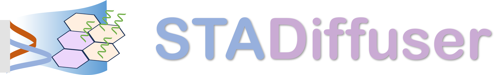

# STADiffuser: a versatile deep generative model for high fidelity simulation of spatial transcriptomics

## Table of Contents
- [Overview](#overview)
- [Architecture](#architecture)
- [Functionality and Applications](#functionality-and-applications)
- [Installation](#installation)
- [Usage](#usage)
- [License](#license)
- [Troubleshooting and Support](#troubleshooting-and-support)


## Overview
STADiffuser is a cutting-edge deep generative model designed to simulate high-fidelity spatial transcriptomic (ST) data. By providing a versatile simulation framework that can generate accurate and detailed ST data, this tool enables various downstream tasks, including: imputation, super-resolution, in silico experiments, and cell type-specific gene identification.

## Architecture
STADiffuser's architecture is composed of a two-stage framework designed for high-fidelity simulation: 
- **Autoencoder with Graph Attention Mechanism**： The autoencoder learns embeddings for spatial spots using a graph attention mechanism, which captures the intricate spatial relationships and gene expression patterns in the data.
- **Latent Diffusion Model with Spatial Denoising Network**： The latent diffusion model generates realistic ST data by diffusing the learned embeddings through a spatial denoising network, which refines the spatial patterns and gene expression profiles.


## Functionality and Applications
STADiffuser offers a range of functionalities and applications that make it a powerful tool for simulating and analyzing spatial transcriptomic data.


Functionality and applicaitons includes:
- **Multi-Sample and 3D Coordinate Modeling**: Handle multiple samples simultaneously and model data in 3D space for comprehensive and realistic simulations.
- **User-Defined Conditions**: Specify various conditions and parameters to customize the simulation process.
- **Accurate Imputation**: Perform accurate imputation of missing data, enhancing dataset completeness and usability.
- **Super-Resolution**: Enhance the resolution of spatial transcriptomic data, enabling detailed study of gene expression patterns.

- **In Silico Experiments**: Enhance statistical power and reduce experimental costs by conducting in silico experiments with simulated data.
- **Cell Type-Specific Gene Identification**: Identify genes specific to particular cell types while controlling for confounding factors.
- **3D Slice Imputation**: Impute missing slices in 3D spatial transcriptomic data, providing a more continuous and complete spatial map of gene expression.

## Installation
It's recommended to create a new virtual environment before installing the dependencies:

```bash
conda create -n STADiffuser python=3.9
```

Activate the virtual environment:

```bash
conda activate STADiffuser
```

### Prerequisites

Make sure you have installed a version of [PyTorch](https://pytorch.org/) (version >= 1.13.1) that is compatible with your GPU (if applicable) first.

```bash
pip install torch==1.13.1+cu117 torchvision==0.14.1+cu117 torchaudio==0.13.1 --extra-index-url https://download.pytorch.org/whl/cu117
```

Replace cu118 with the appropriate CUDA version for your system if it differs from CUDA 11.8. If you are using a CPU-only version, you can simply install PyTorch without specifying a CUDA version. 


Install `torch_geometric` dependencies:

``` bash
pip install torch_scatter torch_sparse torch_cluster torch_spline_conv -f https://data.pyg.org/whl/torch-1.13.1+cu117.html
```

### Install from source code

To install STADiffuser from source code, clone the repository and install the dependencies using the following commands:
```bash
git clone git@github.com:messcode/STADiffuser.git
```

Now you can install the code from the source directory:

```
cd STADiffuser
pip install -e .
```

### Install from PyPI
To install STADiffuser from PyPI, use the following command:
```bash
pip install stadiffuser
```

If you encounter any issues during installation, please refer to the [Troubleshooting](#troubleshooting) section for assistance.
## Usage


## License
The project is licensed under the MIT License. See the [LICENSE](./LICENSE.txt)

## Troubleshooting and Support
If you fail to install, you may need to install the following dependencies manually. 
- [SCANPY](https://scanpy.readthedocs.io/en/stable/installation.html): recommended version 1.9.3
- [PyTorch](https://pytorch.org/get-started/locally/): recommended version 1.13.1
- [PyG](https://pytorch-geometric.readthedocs.io/en/latest/install/installation.html) (PyTorch Geometric): recommended version 2.3.1

### Progress Bar Issue

Failure to show progress bars during training may be due to incompatible versions of the `notebook`, `ipywidgets` and `jupyter`. To resolve this issue, you can install the compatible versions of these packages using the following commands:

```bash
pip install ipywidgets==7.6.5
pip install widgetsnbextension==3.5.1
pip install notebook==6.1.5
```
Please contact us at zhangchihao11@outlook.com
 if you encounter any issues or need further assistance.

